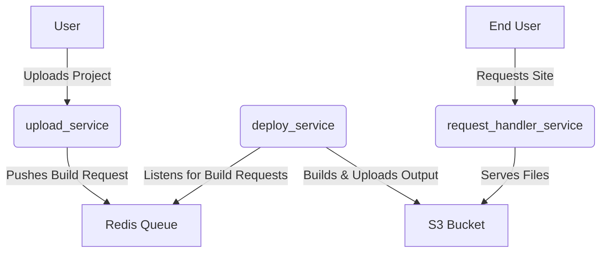

# Vercel-like Monorepo

This monorepo implements a simplified Vercel-like deployment system with three main services:

- **upload_service**: Handles user uploads (codebases), stores them in S3, and queues build requests.
- **deploy_service**: Listens for build requests, builds the code, and uploads the output to S3.
- **request_handler_service**: Serves built static assets from S3 based on incoming requests.

## Architecture Overview

## Flow

1. User uploads a project via `upload_service`.
2. `upload_service` pushes a build request to a Redis queue.
3. `deploy_service` picks up the request, builds the project, and uploads the output to S3.
4. `request_handler_service` serves the built files from S3 to end users.

## Services

- [upload_service](./upload_service/README.md)
- [deploy_service](./deploy_service/README.md)
- [request_handler_service](./request_handler_service/README.md)

## Documentation

- [Detailed Architecture](./docs/architecture.md)
