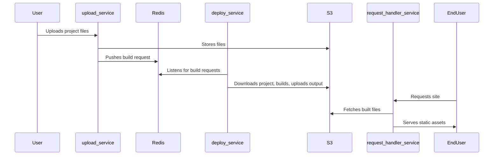

# Architecture Details

## Overview

This system is designed to mimic the core deployment and hosting flow of platforms like Vercel. It is composed of three main services, a Redis queue, and an S3-compatible object store.

### Services

- **upload_service**: Accepts user code uploads, stores them in S3, and enqueues build requests.
- **deploy_service**: Listens for build requests, checks out code, builds it, and uploads the output to S3.
- **request_handler_service**: Serves static files from S3 based on incoming HTTP requests.

### Sequence Diagram

### Service Responsibilities

- **upload_service**: Handles file uploads, interacts with S3, and manages build queueing.
- **deploy_service**: Builds projects, manages build lifecycle, and uploads build artifacts.
- **request_handler_service**: Efficiently serves static content from S3 to users.

### S3 Bucket Structure

- `uploads/{id}/` - Raw uploaded files
- `output/{id}/dist/` - Built static assets

### Redis Usage

- `build-queue` (list): IDs of projects to build
- `status` (hash): Build/upload status per project

## Extensibility

- Add authentication, custom domains, or serverless functions as needed.
- Swap S3/Redis for other providers if desired.
